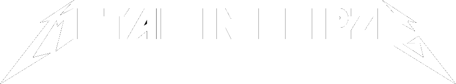

# 

### About
EN: This projects generates a static website of metal music events in Leipzig (Ger).

DE: Dieses Projekt erstellt einen Webkalender zu diversen Metal-Veranstaltungen in Leipzig.

### Angebundene Seiten:
- anker-leipzig.de
- bandcommunity-leipzig.org
- conne-island.de
- felsenkeller-leipzig.com
- haus-auensee-leipzig.de
- hellraiser-leipzig.de
- moritzbastei.de
- rocklounge-leipzig.de
- taeubchenthal.com
- tankbar-leipzig.de
- werk-2.de

### Geplante Locations:
- dark-flower
- arena/festwiese/stadion
- Geyserhaus (Parkbühne/UnterRock?)
- div. Pubs? Black Label, McCormacks
- was fehlt noch? schreibt es mir als [Issue](https://github.com/Knochenmarc/metal-in-leipzig/issues)

### Mehr Ideen:
- Gesetzeskrams
- SEO
- mobile Optimierung
- ics/ical-Export
- Filters (Metal/Rock/Punk; Konzert/Party; Ausverkauft/Verschoben/Abgesagt)
- endless scrolling
