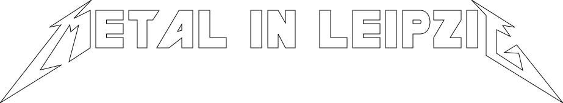

# 

### About

EN: This projects generates a static website of metal music events in Leipzig (Germany).

DE: Dieses Projekt erstellt einen Webkalender zu diversen Metal-Veranstaltungen in Leipzig.
Alle Event-Informationen stammen aus öffentlichen Internetquellen und werden einmal täglich gesammelt und mittels GitHub
publiziert.

### Angebundene Seiten:

- anker-leipzig.de
- bandcommunity-leipzig.org
- conne-island.de
- darkflower.club
- felsenkeller-leipzig.com
- haus-auensee-leipzig.de
- hellraiser-leipzig.de
- moritzbastei.de
- muehlstrasse.de
- mvb-leipzig.de
- noels-ballroom.de
- parkbuehne-leipzig.com
- quarterback-immobilien-arena.de
- taeubchenthal.com
- utconnewitz.de
- werk-2.de

### Geplante Locations:

- rocklounge-leipzig.de
- Geyserhaus (Parkbühne/UnterRock?)
- div. Pubs? Black Label, McCormacks
- Spizz-Keller?

Was fehlt noch? Schreibt es mir als [Issue](https://github.com/Knochenmarc/metal-in-leipzig/issues).

### Mehr Ideen/Todos:

- SEO
- json-ld
- ics/ical-Export
- Filter (Metal/Rock/Punk; Konzert/Party; Ausverkauft/Verschoben/Abgesagt)
- Suche? (-> Strg+F ;))
- Rust: async/parallel http client/site worker
